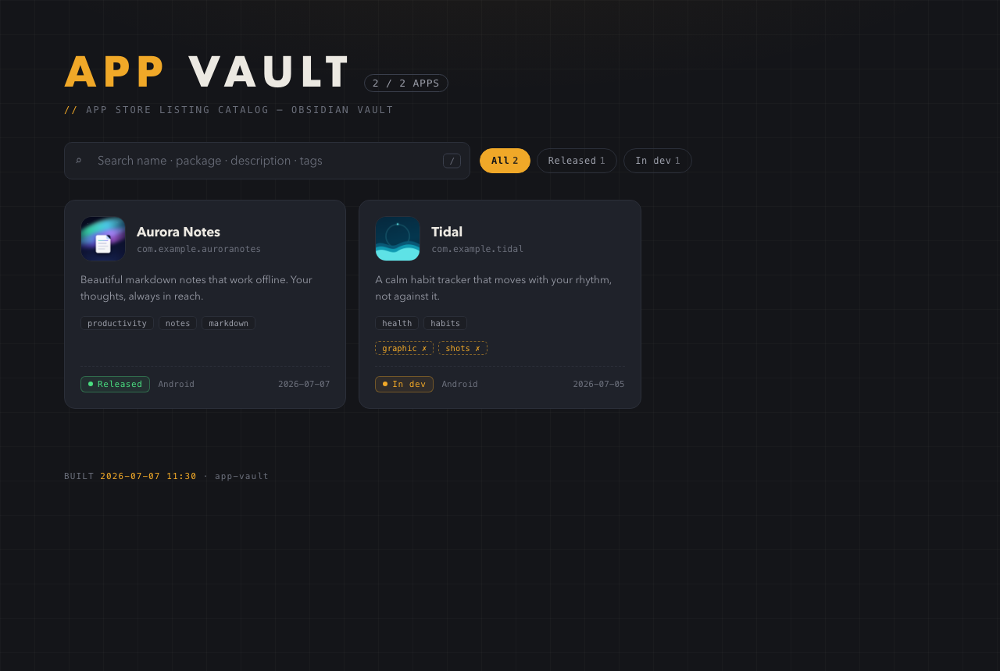
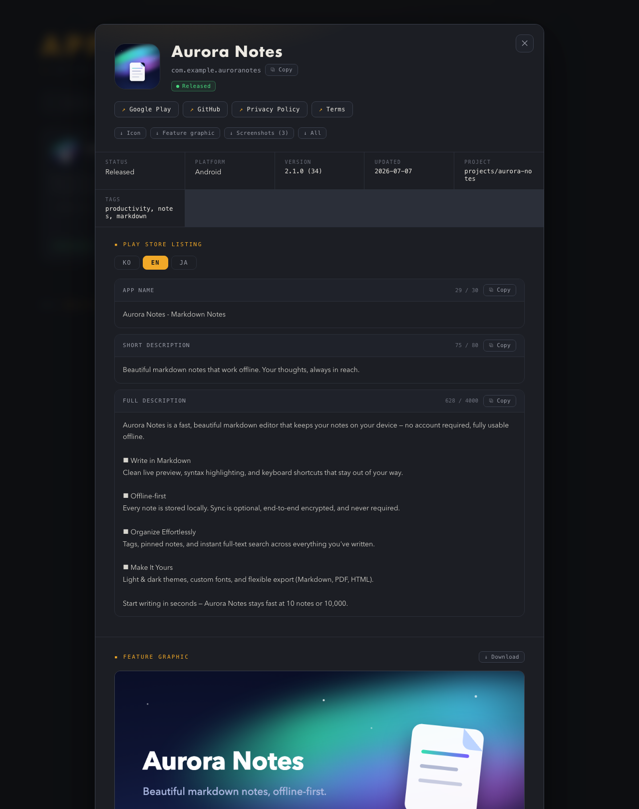

# App Vault

**One place for every app's store listing.** An Obsidian-compatible markdown vault
for app store metadata — names, package IDs, localized descriptions, icons, feature
graphics, screenshots, policy URLs — with a zero-dependency static catalog viewer
and an optional Claude Code skill that fills it automatically.

[한국어 README](README.ko.md)



If you ship multiple apps, their store assets end up scattered across repos —
`docs/store/` here, `branding/` there, a description that only exists inside Play
Console. App Vault gives them a single home that is:

- **Plain markdown + images** — readable and editable in Obsidian (or any editor), greppable, git-friendly
- **Viewable offline** — one self-contained HTML file, no server, no dependencies
- **Automatable** — a Claude Code skill scans your project and files everything for you

## Quickstart

```bash
git clone https://github.com/soulduse/app-vault.git
cd app-vault
python3 scripts/build.py --vault examples/vault --open
```

That builds the bundled demo vault (two fictional apps) and opens the catalog in
your browser. No dependencies beyond Python 3 — the viewer is a single static
HTML file you can open via `file://`.

## The viewer



- **Search & filter** — full-text over names, packages, descriptions, tags, and listings (`/` to focus)
- **Play Store Listing tabs** — per-locale (en/ja/ko/…) app name, short & full description, each with a **copy button** and a live **character counter** against Play limits (30 / 80 / 4000 — turns red when exceeded)
- **Package name copy** — one click, ready to paste into any console form
- **Asset downloads** — icon, feature graphic, and screenshots individually or in bulk, renamed with the app's slug prefix
- **Missing-asset tracking** — cards show `graphic ✗` / `shots ✗` badges; empty slots render placeholders with a *generate request* button (see below)

## Vault format

One folder per app. All data lives in `app.md` (frontmatter + sections) and an
`assets/` folder discovered by convention:

```
vault/
  aurora-notes/
    app.md
    assets/
      icon.png              # 512×512
      feature-graphic.png   # 1024×500
      screenshots/01-home.png …
  _site/index.html          # generated — never edit
```

```markdown
---
appName: Aurora Notes
packageName: com.example.auroranotes
platform: android
status: released            # planning / dev / released / archived
shortDesc: One-liner for the catalog card
tags: [productivity, notes]
---

## Store Listing (en)

### App Name
Aurora Notes - Markdown Notes

### Short Description
Beautiful markdown notes that work offline.

### Full Description
(multi-paragraph store description…)

## Store Listing (ja)
…

## Privacy Policy
…

## Notes
(manual area — automation never touches this section)
```

`## Store Listing (locale)` sections are parsed structurally and become the
viewer's locale tabs. Everything else renders as markdown in the Notes panel.
See [`examples/vault/`](examples/vault/) for two complete entries.

Build your own vault:

```bash
python3 scripts/build.py --vault ~/my-vault/apps          # or set APP_VAULT_DIR
python3 scripts/build.py --vault ~/my-vault/apps --lang ko  # Korean UI
```

## Using with Obsidian

The vault is designed to live **inside your Obsidian vault** — that's the whole
point: your app catalog sits next to your notes and inherits everything Obsidian
gives you for free.

```
YourObsidianVault/
  notes/ …
  apps/                ← app-vault lives here
    aurora-notes/
    tidal/
    _site/index.html   ← generated viewer
```

```bash
python3 scripts/build.py --vault ~/Documents/YourObsidianVault/apps
```

How the two sides divide the work:

- **Obsidian = edit & connect.** Each `app.md` opens as a regular note:
  frontmatter appears in the Properties panel, listing sections are plain
  markdown, and images render in place. Link app entries from anywhere with
  `[[aurora-notes/app]]` wikilinks, and query them with Dataview:

  ```
  TABLE packageName, status, updated
  FROM "apps"
  WHERE packageName
  ```

- **The viewer = browse & ship.** Locale tabs, copy buttons, character counters,
  and asset downloads — things a markdown editor can't do. Rebuild after editing
  and refresh the page.

The generated `_site/index.html` doesn't clutter your vault: Obsidian ignores
`.html` files by default, and the `_`-prefixed folder is skipped by the builder
itself. Obsidian Sync/iCloud/git — whatever syncs your vault syncs your app
catalog too.

## Claude Code skill (optional)

The viewer and builder work standalone. If you use
[Claude Code](https://claude.com/claude-code), the bundled skill turns the vault
into an automated pipeline:

```bash
mkdir -p ~/.claude/skills/app-vault
cp skill/SKILL.md ~/.claude/skills/app-vault/
cp -r scripts ~/.claude/skills/app-vault/
# then set APP_VAULT_DIR in your environment, or edit the paths in SKILL.md
```

What it does:

- **`/app-vault` (save)** — detects the current project's stack (Flutter, native
  Android, Capacitor, React Native), collects the package ID, version, store copy,
  policy URLs and graphic assets, writes/updates `app.md` (**diff-first** — it
  shows you what changes before overwriting), copies assets, and rebuilds.
  Listings are generated in three locales by default, with translated drafts
  marked for review.
- **`/app-vault generate <slug> <asset>`** — the reverse-call loop. Empty asset
  slots in the viewer have a *⚡ Copy generate request* button; paste the copied
  command into Claude Code and it produces the missing icon (image generation),
  feature graphic (wide-ratio generation + 1024×500 crop), or screenshots
  (emulator + adb, or headless Chrome for webview apps), saves them into the
  vault, and rebuilds.
- **`list` / `show` / `delete` / `open`** — catalog management.

The skill file encodes the store-asset gotchas we hit in production: Play's
30/80/4000 character limits, image models drawing a framed "icon inside an icon"
when prompted with the word *icon*, models that can't output 2:1 feature-graphic
ratios, and more.

## FAQ

**Why Obsidian?** It's just markdown — the vault works without Obsidian, but if
you already keep a vault, your app catalog lives next to your notes with
backlinks, graph view, and sync for free.

**Why not a database / web app?** Store metadata changes a few times per release.
Files in git beat a database for this shape of data, and a static page beats a
server you have to run.

**Does the viewer work on Windows/Linux?** Yes — it's a static HTML file. The
builder uses only the Python standard library (`--open` uses `open`/`xdg-open`).

## License

[MIT](LICENSE)
